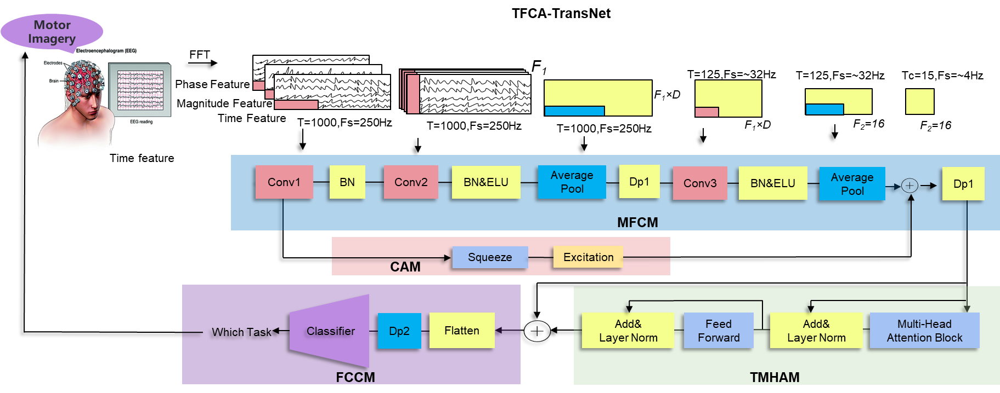

# 🧠 TFCA-Trans: A Novel Approach for EEG Signal Classification  

## 🔍 **Abstract**  
This study proposes **TFCA-Trans**, a hybrid deep learning framework for EEG signal classification, built on the PyTorch framework. The model integrates **frequency-domain features** and **time-domain features**, extracted using **Fast Fourier Transform (FFT)** to obtain **amplitude** and **phase information**, along with the raw time-domain data. Three types of features are processed as follows:  

1. **Feature Extraction:**  
   - A **Convolutional Neural Network (CNN)** equipped with a channel attention mechanism learns the importance of each feature type.  
   - The channel attention mechanism enhances feature representation at the spatial level.  

2. **Feature Encoding:**  
   - A **Transformer encoder module** leverages multi-head attention to further explore high-dimensional feature representations, improving the model's ability to handle complex spatiotemporal relationships in the data.  

3. **Classification:**  
   - A compact and efficient **fully connected layer** constructs the classification module for precise EEG signal decoding.  

---

### 🏆 **Acknowledgment**  
I would like to express my sincere gratitude to **[SnailPT](https://github.com/snailpt/CTNet.git)** for their invaluable support and contributions to this research. Their work on [CTNet](https://github.com/snailpt/CTNet.git) has greatly inspired and informed my approach in designing TFCA-Trans.  

---

## 🚀 **Highlights**  
- **Hybrid Feature Extraction:** Combines time-domain and frequency-domain features for a comprehensive EEG representation.  
- **Transformer Integration:** Enhances the model's capacity to handle high-dimensional spatiotemporal data using multi-head attention.  
- **High Accuracy:** Demonstrates superior performance on diverse datasets, setting new benchmarks in EEG signal decoding.  

---

## 📊 **Experimental Results**  

| Dataset         | Task                         | Accuracy (%) | 
|------------------|------------------------------|--------------|
| BCI IV-2a       | Within-Subject (Cross-Time)  | 84.38        | 
| BCI IV-2b       | Within-Subject (Cross-Time)  | 89.39        | 
| High-Gamma      | High-Frequency Signal Decoding | 95.85       | 

---

## 🌟 **Future Applications**  
TFCA-Trans holds significant potential for:  
- **Brain-Computer Interfaces (BCI):** Improving communication and control systems for individuals with disabilities.  
- **Neurological Disease Monitoring:** Decoding neural activity for early disease detection and monitoring.  
- **Personalized Medicine:** Enabling adaptive and targeted healthcare solutions based on individual neural profiles.  

---

## 📷 **Visualization**  
  
> *Figure: Model architecture .*  

---

## 📂 **Repository Structure**  
- `data/` - Preprocessed EEG datasets.  
- `models/` - Implementation of TFCA-Trans.  
- `results/` - This folder is reserved for experimental analysis scripts. Results are not uploaded.  
- `README.md` - Project documentation and overview.  

---

## 📊 **Data Access**  
The datasets used in this study can be accessed from the following sources:  
- **BCI IV-2a:** [Competition Dataset](https://www.bbci.de/competition/iv/)  
- **BCI IV-2b:** [Competition Dataset](https://www.bbci.de/competition/iv/)  
- **High-Gamma Dataset:** [MOABB Documentation](https://neurotechx.github.io/moabb/generated/moabb.datasets.Schirrmeister2017.html)  

### **Data Preprocessing**  
For preprocessing steps and details, please refer to my paper:  
**TFCA-TransNet: Convolutional Time-Frequency Feature Fusion with Channel Attention Transformer Network for EEG-MI Signal Classification.**  

---

## 📝 **Paper Title**  
> *[ TFCA-TransNet: Convolutional Time-Frequency Feature Fusion with Channel Attention Transformer Network for EEG Signal Decoding]*  

---
## 🛠 **Usage Instructions**  
This repository provides a clear and organized structure for using TFCA-Trans. Below is an overview of the main scripts to help you get started:

```plaintext
code/
├── TFCA_TransNet.py   # Implementation of the TFCA-Trans model
├── experiment.py      # Includes data loading and training scripts
├── utils.py           # Contains utility functions necessary for the workflow
└── main.py            # Entry point for executing the code
```
To run the model, simply execute the main.py script, which ties all the components together:
python code/main.py
If you encounter any issues or have questions, feel free to reach out. 😊

---

## 📫 **Contact**  
Feel free to reach out for collaboration or questions:  
- Email: [tianhuamiao@gmail.com](mailto:tianhuamiao@gmail.com)  

---

**✨ Explore the potential of TFCA-Trans and join the journey of advancing EEG decoding! ✨**
